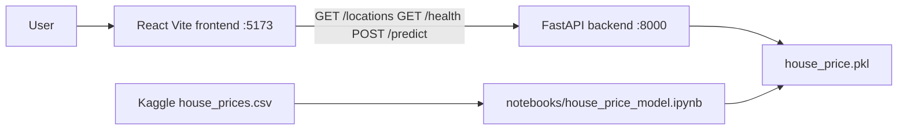

# CasaLens — House Price Prediction

CasaLens is a full-stack machine-learning product: a Jupyter notebook trains a listing-price model on Indian housing data, a FastAPI service serves predictions, and a React frontend collects property details and displays the estimate.

## Architecture



## Tech stack

- Python 3.13, pandas, scikit-learn **1.9.0**, joblib
- FastAPI, uvicorn, pydantic-settings, pytest
- React 19, TypeScript, Vite 8, react-router-dom
- Dataset: [House Price by Juhi Bhojani](https://www.kaggle.com/datasets/juhibhojani/house-price)

## Project structure

```
House_Price_Project/
├── models/house_price.pkl      # exported trained pipeline (~90 MB)
├── models/locations.json       # grouped location labels
├── notebooks/house_price_model.ipynb
├── backend/                    # FastAPI app
└── frontend/                   # CasaLens UI
```

## Dataset

Do **not** commit the raw CSV (~106 MB). Download it yourself:

1. Create a Kaggle account and accept the dataset terms.
2. Either download `house_prices.csv` from the Kaggle page above, or:

```bash
pip install kaggle
kaggle datasets download -d juhibhojani/house-price -p notebooks/data --unzip
```

Place the file at `notebooks/data/house_prices.csv`.

## Model metrics (held-out test set)

Winner: **RandomForestRegressor with log target** (`log1p` / `expm1`), scikit-learn 1.9.0.

| Model | MAE (₹) | RMSE (₹) | R² |
|---|---|---|---|
| RandomForest (log target) | 1,319,924.96 | 4,385,508.17 | 0.8740 |
| RandomForest (raw target) | 1,387,435.62 | 4,483,296.73 | 0.8683 |
| LinearRegression (raw) | 4,490,859.08 | 7,660,166.01 | 0.6155 |

## Backend setup

```bash
python -m venv .venv
# Windows: .venv\Scripts\activate
pip install -r backend/requirements.txt
copy models\house_price.pkl backend\models\house_price.pkl
copy models\locations.json backend\models\locations.json
copy backend\.env.example backend\.env
cd backend
python -m uvicorn app.main:app --host 127.0.0.1 --port 8000
```

The backend limits OpenBLAS / joblib thread pools at startup so the ~90 MB forest can load on machines with constrained RAM. Keep a **single** uvicorn worker (do not use `--reload` on low-memory machines).

### Environment variables (backend)

| Variable | Example | Purpose |
|---|---|---|
| `MODEL_PATH` | `models/house_price.pkl` | Path to the joblib pipeline |
| `LOCATIONS_PATH` | `models/locations.json` | Grouped locations for `/locations` |
| `CORS_ORIGINS` | `http://localhost:5173,http://127.0.0.1:5173` | Allowed frontend origins |

### API

- `GET /health` → `{"status":"ok"}`
- `GET /locations` → `{"locations":[...]}`
- `POST /predict` → `{"predicted_price": <float>}`

```bash
curl http://127.0.0.1:8000/health

curl -X POST http://127.0.0.1:8000/predict ^
  -H "Content-Type: application/json" ^
  -d "{\"location\":\"mumbai\",\"carpet_area_sqft\":1200,\"floor_num\":3,\"bathroom\":2,\"balcony\":1,\"furnishing\":\"Semi-Furnished\",\"transaction\":\"Resale\",\"ownership\":\"Freehold\",\"facing\":\"East\"}"
```

```bash
cd backend
python -m pytest
```

Docs: http://127.0.0.1:8000/docs

## Frontend setup

```bash
cd frontend
copy .env.example .env
npm install
npm run dev
```

Open http://127.0.0.1:5173

### Environment variables (frontend)

| Variable | Example | Purpose |
|---|---|---|
| `VITE_API_BASE_URL` | `http://localhost:8000` | Backend origin (no trailing slash) |

```bash
npm run build
npm run lint
```

## GitHub publishing notes

`models/house_price.pkl` is about **90 MB** (GitHub warns above 50 MB; hard limit 100 MB). Use **Git LFS** for `*.pkl` (this repo includes `.gitattributes`). Do not commit `.venv`, `node_modules`, `.env`, or the raw CSV. After clone:

```bash
git lfs install
git lfs pull
copy models\house_price.pkl backend\models\house_price.pkl
```

The backend pickle is a copy of the notebook export; it is gitignored to avoid storing 180 MB of identical binaries.
